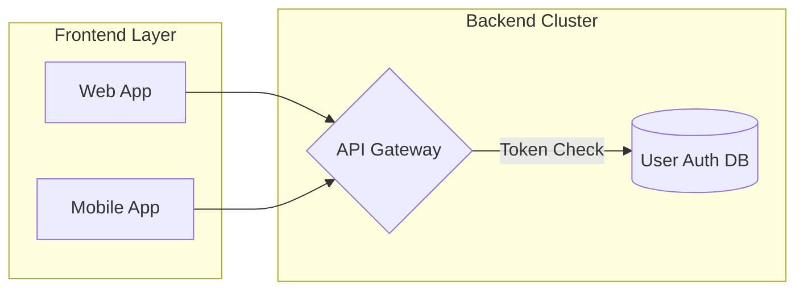
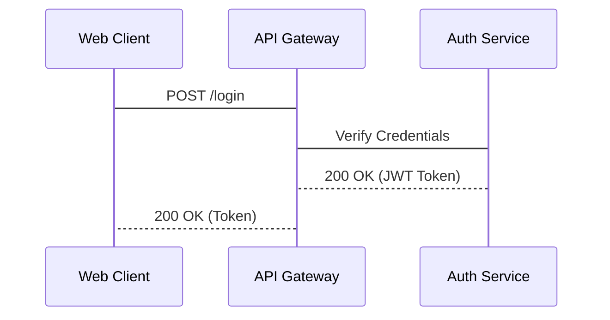

# ascii-diagram v0.12.1

High-precision, Rust-powered terminal ASCII & Unicode diagram generator for humans and AI agents.

```text
      ╭──────────────╮
      │  User / TUI  │
      ╰──────────────╯
              │
              │ Request
              │
              ▼
       ╭─────────────╮
       │ Pi AI Agent │
       ╰─────────────╯
              │
              │ draw_diagram
              │
              ▼
  ╭──────────────────────╮
  │ ascii-diagram Engine │
  ╰──────────────────────╯
              │
              ▼
╭──────────────────────────╮
│ Sugiyama Router & Canvas │
╰──────────────────────────╯
              │
              ▼
    ╭──────── ▱ ────────╮
    │  Terminal Output  │
    ╰───────────────────╯
```

---

## v0.12.1 release highlights

Firmware diagrams now keep nested groups padded and separated, preserve title-crossing routes and decision ingress, and use less space for group titles. Flowchart labels are placed after routing, with multiline blocks kept in their own connection corridors. Architecture routes retain label margins, sibling clearance, and connected source turns.

Stroke redraws preserve color, including complete architecture property dividers. The CLI accepts trailing options after bare input and terminates markdown fences with LF. The extension preserves JSON during automatic coloring, honors explicit `color:false` when freshly loaded, adds command help, and measures ANSI/CJK result frames by visible width.

Release verification passed: **321 Rust tests**, the extension suite, both original firmware specifications in all five styles, **70 byte-identical input-path runs**, and **35 unchanged built-in example/style outputs**. The flight-control diagram measures **54 × 158** rows × columns, down from **54 × 181**; the architecture remains **28 × 83**. See [SPRINT.md](SPRINT.md) for release checks and historical implementation evidence.

There is no automatic fit-to-terminal width cap: dense diagrams can still wrap. An already-running session may retain an old tool wrapper that ignores `color:false`; reload after updating. A live session reload has not yet been verified. Use CLI `--color never` when plain output is required.

## ⚡ 10-Second Quick Start

### 1. Build & Install CLI

```bash
git clone https://github.com/benjaminjamesxyz/ascii-diagram-helper.git
cd ascii-diagram-helper
npm install && npm run build
```

### 2. Instant Diagram Generation

```bash
# Render a Flowchart
./bin/ascii-diagram "graph LR; Client --> Gateway --> Database"

# Render a Data Structure using shorthand
./bin/ascii-diagram "ds tree 8 3 10 1 6 14 4"

# Render built-in reference examples
./bin/ascii-diagram example sequence
```

### 3. Update an Existing Installation

You need Rust/Cargo, Node.js, and npm. To install the tagged `v0.12.1` release, run the following in your existing repository checkout with a clean working tree:

```bash
git fetch origin --tags
git switch --detach v0.12.1
npm install && npm run build
./bin/ascii-diagram --version
```

The build installs the release binary into `bin/` and attempts to copy it to `~/.local/bin`; check any skipped-install message if you use the latter on `PATH`.

For an **existing Pi Git-package installation** at `~/.pi/agent/git/github.com/benjaminjamesxyz/ascii-diagram-helper`, synchronize the rebuilt binary, extension, and skills from this checkout:

```bash
npm run sync:pi
```

`sync:pi` is not a first-time package installer and does **not** update omp's separate `~/.omp/plugins/node_modules/ascii-diagram-helper` copy. If you use that copy, update or re-link it through your host's package installation mechanism to the released checkout, then run `npm install && npm run build` in that package directory. Restart or reload the host session after updating either installation so it loads the new extension and tool wrapper; replacing a binary alone does not refresh loaded JavaScript. The source/tag update path does not imply npm registry publication.

---

## 🎨 Visual Showcase (7 Diagram Types)

### 1. Flowcharts & Graphs (`flowchart` / `graph`)

Supports Mermaid `graph TD` / `graph LR`, custom node shapes (`[]`, `()`, `{}`, `[()]`, `([])`, `[[]]`), styled edges (`-->`, `-.->`, `==>`, `<-->`), subgraphs, and `classDef`/`style` colors.

**DSL Input:**


**Rendered Output:**
```text


 ╭  Frontend Layer  ───────╮
 │                         │
 │ ╭─────────╮             │
 │ │ Web App │─────╮       │
 │ ╰─────────╯     │       │
 │                 │       │
 │                 │       │
 │ ╭────────────╮  │       │
 │ │ Mobile App │──┤       │
 │ ╰────────────╯  │       │
 ╰─────────────────┼───────╯
                   │
                   │
                   │╭  Backend Cluster  ─────────────────────────────────╮
                   ││                                                    │
                   ││                                 ╭────────────────╮ │
                   ││ ╭────── ◇ ──────╮  Token Check  (                ) │
                   ╰┼►├  API Gateway  ┤──────────────►(  User Auth DB  ) │
                    │ ╰───────────────╯               (                ) │
                    │                                 ╰────────────────╯ │
                    ╰────────────────────────────────────────────────────╯
```

---

### 2. Sequence Diagrams (`sequenceDiagram`)

Supports lifelines, synchronous calls (`->`), asynchronous messages (`-->`), self-loops (`A -> A`), and control frames (`alt`, `opt`, `loop`, `par`, `critical`, `break`).

**DSL Input:**


**Rendered Output:**
```text
╭────────────╮    ╭─────────────╮      ╭──────────────╮
│ Web Client │    │ API Gateway │      │ Auth Service │
╰──────┬─────╯    ╰──────┬──────╯      ╰───────┬──────╯
       │                 │                     │
       │  POST /login    │                     │
       ├────────────────►│                     │
       │                 │ Verify Credentials  │
       │                 ├────────────────────►│
       │                 │ 200 OK (JWT Token)  │
       │                 │◄╌╌╌╌╌╌╌╌╌╌╌╌╌╌╌╌╌╌╌╌│
       │ 200 OK (Token)  │                     │
       │◄╌╌╌╌╌╌╌╌╌╌╌╌╌╌╌╌│                     │
       │                 │                     │
╭──────┴─────╮    ╭──────┴──────╮      ╭───────┴──────╮
│ Web Client │    │ API Gateway │      │ Auth Service │
╰────────────╯    ╰─────────────╯      ╰──────────────╯
```

---

### 3. Architecture & Container Diagrams (`architecture`)

Declarative JSON specifications with row/column layouts, component property badges (`Port`, `Protocol`), and margin corridor routing. Connection labels reserve a blank display cell at each end, keeping text clear of adjacent strokes.

**JSON Spec:**
```json
{
  "type": "architecture",
  "title": "Cloud System Architecture",
  "containers": [
    {
      "id": "c1",
      "title": "Production VPC",
      "layout": "row",
      "items": [
        {"id": "api", "name": "API Server", "properties": [["Port", "8080"], ["Lang", "Rust"]]},
        {"id": "db", "name": "Database", "properties": [["Engine", "PostgreSQL"], ["Port", "5432"]]}
      ]
    }
  ],
  "connections": [
    {"from": "api", "to": "db", "label": "SQL Query"}
  ]
}
```

**Rendered Output:**
```text
               Cloud System Architecture

╭─────────────────── Production VPC ───────────────────╮
│                                                      │
│ ╭────────────╮   SQL Query    ╭────────────────────╮ │
│ │ API Server ├───────────────►┤      Database      │ │
│ ├────────────┤                ├────────────────────┤ │
│ │ Port: 8080 │                │ Engine: PostgreSQL │ │
│ │ Lang: Rust │                │ Port: 5432         │ │
│ ╰────────────╯                ╰────────────────────╯ │
│                                                      │
╰──────────────────────────────────────────────────────╯
```

---

### 4. Directory & Hierarchy Trees (`tree`)

Clean tree structures using indented lines, parenthetical annotations, and inline `@color` tags. An annotation is recognized only as the **final** whitespace-delimited `(…)` group of a line (`src (CLI entry)`); any other parentheses stay literal, so `foo(1).rs` renders verbatim. A single leading bullet marker (`- `, `* `, `+ `) is stripped. A root entry named `tree` is allowed when any following line is indented.

**DSL Input:**
```text
tree
src/
  main.rs (CLI Entrypoint) @cyan
  canvas.rs (2D Grid Engine)
  flowchart.rs (Sugiyama Layout)
  datastructure.rs (BST & B-Tree) @green
Cargo.toml @yellow
```

**Rendered Output:**
```text
src/
├── main.rs (CLI Entrypoint)
├── canvas.rs (2D Grid Engine)
├── flowchart.rs (Sugiyama Layout)
├── datastructure.rs (BST & B-Tree)
╰── Cargo.toml
```

---

### 5. Memory & Protocol Stacks (`stack`)

Memory segment layouts with hex address offsets (`0xFFFF:`), growth direction indicators, and region tinting.

**DSL Input:**
```text
stack
0xFFFF: Kernel Memory @red
0xC000: User Stack (grows down) @cyan
Shared Libraries
Heap Space (grows up) @green
0x0000: Executable Code / Text
```

**Rendered Output:**
```text
0xFFFF ╭──────────────────────────╮
       │      Kernel Memory       │
0xC000 ├──────────────────────────┤
       │        User Stack        │
       │        grows down        │
       ├──────────────────────────┤
       │     Shared Libraries     │
       ├──────────────────────────┤
       │        Heap Space        │
       │         grows up         │
0x0000 ├──────────────────────────┤
       │  Executable Code / Text  │
       ╰──────────────────────────╯
```

---

### 6. Tables (`table`)

Markdown pipe tables with alignment specifiers (`:---`, `:---:`, `---:`) and custom grid color directives.

**DSL Input:**
```text
table
color: cyan
| Service | Port | Protocol | Status |
| :--- | :---: | :---: | ---: |
| Gateway | 8080 | HTTP | Active |
| Auth DB | 5432 | TCP | Active |
| Cache | 6379 | RESP | Idle |
```

**Rendered Output:**
```text
╭─────────┬──────┬──────────┬────────╮
│ Service │ Port │ Protocol │ Status │
├─────────┼──────┼──────────┼────────┤
│ Gateway │ 8080 │   HTTP   │ Active │
│ Auth DB │ 5432 │   TCP    │ Active │
│ Cache   │ 6379 │   RESP   │   Idle │
╰─────────┴──────┴──────────┴────────╯
```

---

### 7. Data Structures (`datastructure`)

Renders standard Computer Science data structures via JSON specs or instant `ds` CLI commands.

---

## 🌳 Complete Data Structures Guide

Supports all 7 core data structure visualizers via JSON specifications, with instant CLI `ds` shorthand for trees, B-trees, linked lists, and arrays.

### 1. Binary Search Tree (BST)
- **CLI Shorthand:** `ascii-diagram "ds tree 8 3 10 1 6 14 4"`
- **JSON Spec:** `{"type":"datastructure","kind":"tree","values":["8","3","10","1","6","14","4"]}`

```text
         ╭───╮
         │ 8 │
         ╰───╯
           │
      ╭────┴─────────╮
      │              │
    ╭───╮         ╭────╮
    │ 3 │         │ 10 │
    ╰───╯         ╰────╯
      │              │
  ╭───┴────╮      ╭────╮
  │        │      │ 14 │
╭───╮    ╭───╮    ╰────╯
│ 1 │    │ 6 │
╰───╯    ╰───╯
           │
         ╭───╮
         │ 4 │
         ╰───╯
```

### 2. B-Tree
- **CLI Shorthand:** `ascii-diagram "ds btree 10,20 | 3,5 12,15 25,30"`
- **JSON Spec:** `{"type":"datastructure","kind":"btree","btree_root":{"keys":["10","20"],"children":[{"keys":["3","5"]},{"keys":["12","15"]},{"keys":["25","30"]}]}}`

```text
              ╭─────────╮
              │ 10 │ 20 │
              ╰─────────╯
                   │
    ╭─────────────┬┴─────────────╮
    │             │              │
╭───────╮    ╭─────────╮    ╭─────────╮
│ 3 │ 5 │    │ 12 │ 15 │    │ 25 │ 30 │
╰───────╯    ╰─────────╯    ╰─────────╯
```

### 3. Linked List
- **CLI Shorthand:** `ascii-diagram "ds linkedlist 10 20 30"`
- **JSON Spec:** `{"type":"datastructure","kind":"linkedlist","nodes":["10","20","30"]}`

```text
        ╭────────╮    ╭────────╮    ╭────────╮
head ─► │ 10 │ ● │ ─► │ 20 │ ● │ ─► │ 30 │ ∅ │
        ╰────────╯    ╰────────╯    ╰────────╯
```

### 4. Array with Index Ruler
- **CLI Shorthand:** `ascii-diagram "ds array 10 20 30 40"`
- **JSON Spec:** `{"type":"datastructure","kind":"array","values":["10","20","30","40"]}`

```text
  0    1    2    3
╭───────────────────╮
│ 10 │ 20 │ 30 │ 40 │
╰───────────────────╯
```

### 5. Queue & Deque
- **JSON Spec:** `{"type":"datastructure","kind":"queue","title":"Job Queue","nodes":["build","test","deploy"]}`

```text
                       Job Queue

         ╭────────╮    ╭────────╮    ╭────────╮
front ─► │ build  │ ─► │ test   │ ─► │ deploy │ ─► rear
         ╰────────╯    ╰────────╯    ╰────────╯
```

### 6. Complete Min/Max Heap
- **JSON Spec:** `{"type":"datastructure","kind":"heap","title":"Min-Heap","values":[1,3,2,6,4,5]}`

```text
       Min-Heap

         ╭───╮
         │ 1 │
         ╰───╯
           │
      ╭────┴────────╮
      │             │
    ╭───╮         ╭───╮
    │ 3 │         │ 2 │
    ╰───╯         ╰───╯
      │             │
  ╭───┴────╮      ╭───╮
  │        │      │ 5 │
╭───╮    ╭───╮    ╰───╯
│ 6 │    │ 4 │
╰───╯    ╰───╯
```

### 7. Graph Adjacency List
- **JSON Spec:** `{"type":"datastructure","kind":"graph","title":"Adjacency List","nodes":["a","b","c","d"],"edges":[["a","b"],["a","c"],["b","d"],["c","d"],["d","a"],["d","d"]]}`

```text
    Adjacency List

╭───╮    ╭───╮    ╭───╮
│ a │ ─► │ b │ ─► │ c │
╰───╯    ╰───╯    ╰───╯

╭───╮    ╭───╮
│ b │ ─► │ d │
╰───╯    ╰───╯

╭───╮    ╭───╮
│ c │ ─► │ d │
╰───╯    ╰───╯

╭───╮    ╭───╮    ╭───╮
│ d │ ─► │ a │ ─► │ d │
╰───╯    ╰───╯    ╰───╯
```

---

## 🛠️ Multi-Style & ANSI Color Showcase

### 5 Border Styles (`-s / --style`)

Choose from 5 distinct box-drawing character sets:

#### `rounded` (Default)
```text
╭────────╮     ╭────────╮
│ Client │────►│ Server │
╰────────╯     ╰────────╯
```

#### `sharp`
```text
┌────────┐     ┌────────┐
│ Client │────►│ Server │
└────────┘     └────────┘
```

#### `double`
```text
╔════════╗     ╔════════╗
║ Client ║════►║ Server ║
╚════════╝     ╚════════╝
```

#### `heavy`
```text
┏━━━━━━━━┓     ┏━━━━━━━━┓
┃ Client ┃━━━━►┃ Server ┃
┗━━━━━━━━┛     ┗━━━━━━━━┛
```

#### `ascii` (Pure 7-bit ASCII)
```text
+--------+     +--------+
| Client |---->| Server |
+--------+     +--------+
```

### ANSI SGR Colors

`ascii-diagram` generates truecolor (24-bit hex `#RRGGBB`) or theme-adaptive ANSI 16 colors for borders, connections, and labels:

- **Flowcharts:** `classDef hot stroke:red`, `style Node fill:#ff8800`
- **Trees & Stacks:** `@red`, `@cyan`, `@green`, `@yellow` trailing tags
- **Tables:** `color: cyan` grid directive
- **Data Structures:** `"color": "cyan"` properties on nodes
- **Architecture:** `"color": "cyan"` on containers, components, and connections; component property dividers use the component's border color.

Unstyled redraws retain existing stroke color, including shared connectors and arrows. At shared wire cells, the last explicit stroke color wins; node borders keep their own color. Flowchart title detours retain the crossing edge's color. Labels stay terminal-default unless explicitly styled.

---

## 💻 CLI & Pi AI Agent Integration

### CLI Subcommands

- `ascii-diagram dsl "<dsl>"`: Render inline DSL string directly.
- `ascii-diagram render <file|->`: Render from file or stdin.
- `ascii-diagram example <type>`: Output reference examples (`flowchart`, `sequence`, `architecture`, `tree`, `table`, `stack`, `datastructure`, `queue`, `heap`, `graph`, `linkedlist`, `array`; aliases `ds`, `btree`, `bst`, `binarytree`). Bare `example` defaults to `flowchart`; an unknown type exits non-zero with an error naming the valid types.
- `ascii-diagram "ds <kind> <args>"`: CLI shorthand for data structures (`tree`, `btree`, `linkedlist`, `array`).

#### Global CLI Options

- `-s, --style <STYLE>`: `rounded` (default), `sharp`, `double`, `heavy`, `ascii`.
- `-m, --markdown`: Wrap output in a safe markdown fenced code block (` ```text `), with a newline after the closing fence.
- `--color <MODE>`: `auto` colors explicitly styled input, even when piped or when `NO_COLOR` is set; otherwise it checks TTY and `NO_COLOR`. `always` forces ANSI; `never` suppresses all ANSI.

Options may precede or follow a bare file or quoted DSL input: `ascii-diagram spec.mmd -s double -m`. Quote DSL containing option-like tokens, or use `--` before literal arguments: `ascii-diagram -s ascii -- "graph TD; A --> B"`.

---

### Pi AI Agent Integration

`ascii-diagram` integrates directly with the **Pi AI Agent Harness**:

1. **`draw_diagram` Tool**: Render flowcharts, sequence diagrams, architectures, stacks, tables, and data structures. Color is enabled by default; `color:false` suppresses even explicit styles. Automatic flowchart colors never modify JSON specifications. Result frames fit the diagram's visible width, including ANSI and CJK content.
2. **`/diagram` Interactive Command**: Users can render diagrams interactively inside Pi TUI:
   ```bash
   /diagram graph TD; Client --> Server
   /diagram --example sequence
   /diagram --style ascii ds tree 8 3 10 1 6
   ```
   Leading flags combine in any order before the diagram text:
   - `--color`: force ANSI colors, including cyan/blue defaults for unstyled flowcharts; overrides `NO_COLOR`
   - `--style <rounded|sharp|double|heavy|ascii>`: border style
   - `--example <type>`: render a built-in reference example instead of DSL
   - `--help` / `-h`: show usage without invoking the renderer
   Assistant Mermaid blocks are rendered automatically through the `assistant_message` hook in omp (or the Markdown transformer in upstream Pi). Unstyled flowcharts receive cyan borders and blue connectors; user-defined classes are preserved. Reload an existing session after updating the installed extension.
3. **Bundled Agent Skills**:
   - `skills/ascii-diagram`: Prompts AI agents to generate structured terminal diagrams instead of breaking text layouts.
   - `skills/ascii-diagram-qa`: Systematic QA testing probe matrix and reviewer audit protocol for diagram types.

---

## 📋 Known Limitations & Tips

| Feature / Category | Limitation / Behavior | Recommendation / Workaround |
|---|---|---|
| **Subgraph Direction** | `direction` per subgraph applies when the subgraph is edge-isolated | Minimize cross-edges between subgraphs if custom subgraph direction is needed |
| **Group Layout Width** | Titles reuse existing member padding, but complete titles and separated groups can still exceed terminal width; sibling node widths remain content-sized | Shorten group titles or split a dense firmware diagram into focused views |
| **Edge Density** | Dense cross-branch edges (>2 per node) share corridor tracks | Keep cross-branch feeds $\le 2$ per node; use dashed `-.->` lines for supervisory control |
| **Edge Labels** | Labels are placed after routing, with blank horizontal margins; multiline labels move together within their connection band. Oversized labels may extend the layout rather than disappear or overwrite a route | Keep labels concise; use `<br/>` for explicit flowchart label line breaks |
| **Color Support** | `stroke:<color>` colorizes borders/lines; `fill:<color>` tints labels. Standard ANSI names adapt to the theme; extended names (`orange`, `purple`, `brown`) and hex use truecolor | Use `--color never` for guaranteed plain output, or `--color always` to force ANSI |
| **Header-only DSL** | `flowchart TD` or `sequenceDiagram` without nodes returns empty output | Always declare at least one node or participant |
| **Pipe Disambiguation** | Single-pipe text without headers parses as `tree`, not `table` | Use explicit `table` keyword or standard pipe headers for tables |
| **Implicit Nodes** | Undeclared edge endpoints (`A --> Z`) are auto-declared as new nodes — Mermaid parity, by design | Declare participants explicitly when a typo should error instead of creating a node |
| **Empty Node Labels** | An explicitly empty bracket label (`A[ ]`) falls back to the node id as label, with a stderr warning naming the node | Leave brackets off (`A`) for the normal unlabeled form |
| **Dangling Edges** | `A -->` / `--> B` is a hard error (no target / no source); nothing renders | Always write both endpoints: `A --> B` |
| **Tree Directories** | A trailing `/` on a tree label is plain text — directories get no automatic visual distinction | Add an explicit `@cyan` tag (`src/ @cyan`) when you want directories to stand out |
| **Sequence Label Width** | Message and note labels never wrap or truncate — the diagram grows to the longest label (only participant headers truncate); there is no `--width` clamp | Keep message labels short; target $\le 100$ columns overall (see SKILL.md width guidelines) |
| **Unicode Widths** | `U+FE0F` presentation selectors count as 1 column but render 2 in emoji-presentation terminals; ZWJ/skin-tone emoji clusters (👍🏽, 👨‍👩‍👧) count 2 columns — legacy terminals that render them wider will drift. Zero-width characters (ZWSP, ZWNJ, bidi controls) are stripped; only the first 2 combining marks per base character are kept | Prefer precomposed text (`café`, not `cafe` + combining mark); avoid emoji inside boxes when exact alignment matters |
| **Unknown JSON Fields** | Unknown fields in JSON specs (including Mermaid-native `stroke` on architecture connections) are silently ignored | Use the documented field for connections: `color` (not `stroke`) |

---

## ⚡ Why LLM Diagrams Break in Terminals

When LLMs attempt to output ASCII art or box-drawing characters line-by-line, layout errors are unavoidable:

1. **Multi-byte UTF-8 Character Widths**: Unicode box glyphs (`─`, `│`, `╭`, `╰`) consume 3 bytes in UTF-8 but occupy exactly 1 terminal column. LLMs frequently miscount column offsets.
2. **Autoregressive 2D Constraints**: Predicting line N requires knowing the maximum text width across all subsequent lines 2..N-1 before they are generated.
3. **Orthogonal Routing & Junctions**: Routing connector lines and resolving intersections (`┬`, `┴`, `┼`, `├`, `┤`) requires global 2D grid allocation.

`ascii-diagram` solves this by consuming clean Mermaid DSL or JSON, applying the **Sugiyama topological layout algorithm**, and rendering aligned Unicode or ASCII box art.
